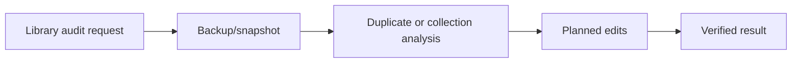

# Zotero Library Organizer Skill

Portable Zotero library-maintenance skill for audit-first organization, duplicate analysis, and safe direct SQLite workflows.

## Who This Is For

| Use this when you... | Use something else when you... |
| --- | --- |
| need to audit or reorganize a Zotero library | only need one PDF attachment path |
| want duplicate, unfiled item, or collection cleanup | need to debug Zotero MCP startup |
| need backup-before-write guidance for direct SQLite maintenance | need a literature review without library edits |

## Why This Exists

- Zotero library writes need a backup-first workflow.
- Organization, dedupe, and normalization should be audited before mutation.
- Lookup and whole-library maintenance stay separate.

## What Ships

| Component | Role |
| --- | --- |
| [`zotero-library-organizer`](./zotero-library-organizer) | installable Codex App skill package |
| [`zotero-library-organizer/references`](./zotero-library-organizer/references) | bundled public reference material |
| [`zotero-library-organizer/scripts`](./zotero-library-organizer/scripts) | bundled helper scripts |
| [`zotero-library-organizer/test-prompts.json`](./zotero-library-organizer/test-prompts.json) | trigger and non-trigger examples |
| [`CHANGELOG.md`](./CHANGELOG.md) | release history |
| [`LICENSE`](./LICENSE) | license |

## Install / Use

### Codex App

- Install the skill from this repo path: `zotero-library-organizer`
- GitHub install target:
  - repo: `Mingdao007/zotero-library-organizer-skill`
  - path: `zotero-library-organizer`
- Restart `Codex App` after installation so the new skill is discovered.

## Workflow

## Coverage

- audit-first workflow before direct database writes
- duplicate and unfiled-item analysis from a copied SQLite snapshot
- backup-before-write guidance for deterministic library maintenance

## Expected Result / Verification

| Check | Expected result |
| --- | --- |
| Install target | `zotero-library-organizer` |
| GitHub target | `Mingdao007/zotero-library-organizer-skill` with path `zotero-library-organizer` |
| Skill entrypoint | `zotero-library-organizer/SKILL.md` exists |
| Trigger examples | `zotero-library-organizer/test-prompts.json` |
| Privacy check | public package contains no private local paths or live user state |

## Trigger Examples

- `Audit this Zotero library before cleanup.`
- `Find duplicates and unfiled items safely.`
- `Plan a deterministic Zotero collection reorganization.`

## Non-Trigger Examples

- `Only locate one local PDF attachment.`
- `Debug a Zotero MCP startup issue.`
- `Do a literature review without library edits.`

## Privacy Boundary

This public repository keeps the workflow generic and reusable.

- User-specific taxonomy wording is rewritten into generic policy wording where needed.
- Database defaults use host-relative paths or environment overrides instead of private absolute paths.

## Repository Layout

| Path | Purpose |
| --- | --- |
| [`zotero-library-organizer`](./zotero-library-organizer) | installable Codex App skill package |
| [`zotero-library-organizer/references`](./zotero-library-organizer/references) | bundled public reference material |
| [`zotero-library-organizer/scripts`](./zotero-library-organizer/scripts) | bundled helper scripts |
| [`zotero-library-organizer/test-prompts.json`](./zotero-library-organizer/test-prompts.json) | trigger and non-trigger examples |
| [`CHANGELOG.md`](./CHANGELOG.md) | release history |
| [`LICENSE`](./LICENSE) | license |

Chinese:

- [README.zh-CN.md](./README.zh-CN.md)
