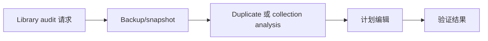

# Zotero Library Organizer Skill

可移植的 Zotero library-maintenance skill，用于 audit-first organization、duplicate analysis 和安全的 direct SQLite workflow。

## 适合谁

| 适合使用 | 不适合使用 |
| --- | --- |
| 需要 audit 或 reorganize Zotero library | 只需要查一个 PDF attachment path |
| 需要处理 duplicate、unfiled item 或 collection cleanup | 需要 debug Zotero MCP startup |
| 需要 direct SQLite maintenance 的 backup-before-write guidance | 只做 literature review，不编辑 library |

## 为什么需要它

- Zotero library 写操作需要 backup-first workflow。
- organization、dedupe 和 normalization 应先 audit 再 mutate。
- lookup 和 whole-library maintenance 保持分离。

## 包含内容

| Component | 作用 |
| --- | --- |
| [`zotero-library-organizer`](./zotero-library-organizer) | 可安装的 Codex App skill package |
| [`zotero-library-organizer/references`](./zotero-library-organizer/references) | 随包发布的公开 reference material |
| [`zotero-library-organizer/scripts`](./zotero-library-organizer/scripts) | 随包发布的 helper scripts |
| [`zotero-library-organizer/test-prompts.json`](./zotero-library-organizer/test-prompts.json) | trigger / non-trigger 示例 |
| [`CHANGELOG.md`](./CHANGELOG.md) | release history |
| [`LICENSE`](./LICENSE) | license |

## 安装 / 使用

### Codex App

- 从本 repo 的这个路径安装 skill：`zotero-library-organizer`
- GitHub install target:
  - repo: `Mingdao007/zotero-library-organizer-skill`
  - path: `zotero-library-organizer`
- 安装后重启 `Codex App`，让新 skill 被重新发现。

## 工作流

## 覆盖范围

- direct database writes 前的 audit-first workflow
- 基于 SQLite copy 分析 duplicate 和 unfiled item
- deterministic library maintenance 的 backup-before-write guidance

## 预期结果 / 验证

| 检查项 | 预期结果 |
| --- | --- |
| 安装路径 | `zotero-library-organizer` |
| GitHub target | `Mingdao007/zotero-library-organizer-skill`，path 为 `zotero-library-organizer` |
| Skill 入口 | 存在 `zotero-library-organizer/SKILL.md` |
| 触发样例 | `zotero-library-organizer/test-prompts.json` |
| 隐私检查 | 公开包不包含私人本机路径或 live user state |

## 触发示例

- `Audit this Zotero library before cleanup.`
- `Find duplicates and unfiled items safely.`
- `Plan a deterministic Zotero collection reorganization.`

## 不应触发

- `Only locate one local PDF attachment.`
- `Debug a Zotero MCP startup issue.`
- `Do a literature review without library edits.`

## 隐私边界

这个公开仓库只保留通用、可复用的 workflow。

- 必要时把 user-specific taxonomy wording 改写为 generic policy wording。
- database defaults 使用 host-relative paths 或 environment overrides，不使用 private absolute paths。

## 仓库结构

| 路径 | 作用 |
| --- | --- |
| [`zotero-library-organizer`](./zotero-library-organizer) | 可安装的 Codex App skill package |
| [`zotero-library-organizer/references`](./zotero-library-organizer/references) | 随包发布的公开 reference material |
| [`zotero-library-organizer/scripts`](./zotero-library-organizer/scripts) | 随包发布的 helper scripts |
| [`zotero-library-organizer/test-prompts.json`](./zotero-library-organizer/test-prompts.json) | trigger / non-trigger 示例 |
| [`CHANGELOG.md`](./CHANGELOG.md) | release history |
| [`LICENSE`](./LICENSE) | license |

English:

- [README.md](./README.md)
